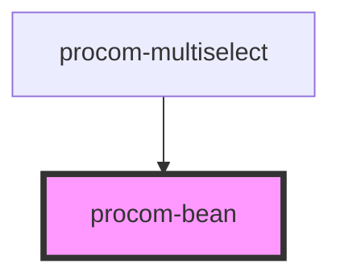

# procom-bean

<!-- Auto Generated Below -->

## Properties

| Property    | Attribute   | Description | Type                | Default         |
| ----------- | ----------- | ----------- | ------------------- | --------------- |
| `itemId`    | `item-id`   |             | `number`            | `undefined`     |
| `name`      | `name`      |             | `string`            | `"Procom Bean"` |
| `variation` | `variation` |             | `"dark" \| "light"` | `"dark"`        |

## Events

| Event        | Description | Type               |
| ------------ | ----------- | ------------------ |
| `removeBean` |             | `CustomEvent<any>` |

## Dependencies

### Used by

 - [procom-multiselect](../procom-multiselect)

### Graph

----------------------------------------------

*Built with [StencilJS](https://stenciljs.com/)*
