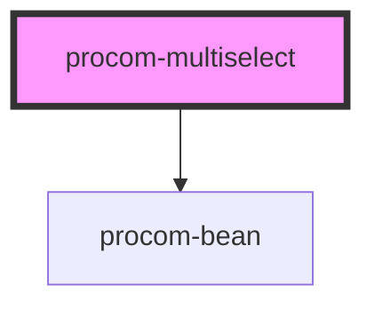

# my-component

<!-- Auto Generated Below -->

## Properties

| Property    | Attribute   | Description | Type                | Default                                                                                                                                                                                                                                 |
| ----------- | ----------- | ----------- | ------------------- | --------------------------------------------------------------------------------------------------------------------------------------------------------------------------------------------------------------------------------------- |
| `name`      | `name`      |             | `string`            | `"Procom Multi-select"`                                                                                                                                                                                                                 |
| `options`   | `options`   |             | `string`            | ``[     {"text":"Coffee", "isSelected":"false"},     {"text":"Bagels", "isSelected":"false"},     {"text":"Toast", "isSelected":"false"},     {"text":"Eggs", "isSelected":"false"},     {"text":"Avocado", "isSelected":"false"}   ]`` |
| `variation` | `variation` |             | `"dark" \| "light"` | `"dark"`                                                                                                                                                                                                                                |

## Events

| Event                 | Description | Type               |
| --------------------- | ----------- | ------------------ |
| `clickedDropdownItem` |             | `CustomEvent<any>` |

## Dependencies

### Depends on

- [procom-bean](../procom-bean)

### Graph

----------------------------------------------

*Built with [StencilJS](https://stenciljs.com/)*
